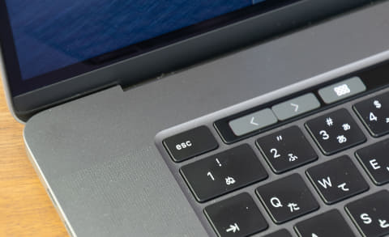
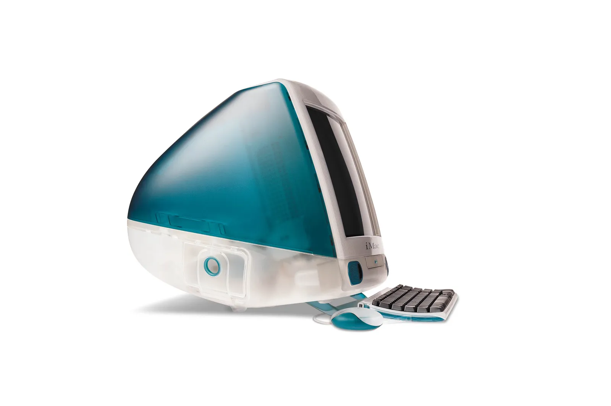
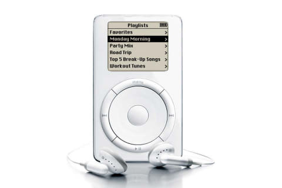
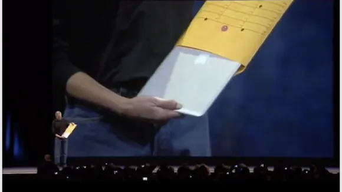

# 行き過ぎたデザインファースト

Apple が Apple M1 という ARM アーキテクチャの CPU を発表し、また同 CPU を搭載した Mac を発売したのが 2020 年 11 月 10 日でした。この CPU は従来の Intel の CPU よりも高速・省電力・低発熱で、MacBook のモデルによってはファンレスであったりもし、これまでのアーキテクチャとの互換性が損なわれるのを考慮しても非常に魅力的な製品でした。

ただし、それほどまでにも魅力的にもかかわらず、筆者はそれまで使用していた 2015 年モデルの MacBook Pro 15 インチモデル[^MacBook-Pro-15-Inch]から買い替えませんでした。

M1 MacBook Air[^M1-MacBook-Air] は最大メモリが 16GB であることと、外部ディスプレイが 1 台しか接続できないこと、M1 MacBook Pro 13 インチモデル[^M1-MacBook-Pro-13-Inch]は Touch Bar を搭載していたことが買い替えをできない決め手でした。

## Touch Bar

Touch Bar は 2016 年に登場した MacBook Pro に初めて搭載されました。当初は Apple らしい洗練されたユーザインタフェースがユーザに好意的に受け取られた印象[要出典]でしたが、自分で使ってみるとなると非常に使いづらい[^Useless]ため、次第にユーザからは敬遠される機能であった[要出典]かと思います。あまりにも不評[要出典]であったためか 2019 年モデルからは esc キーを仮想キーから物理キーに戻しています。

画像は <https://www.lifehacker.jp/article/24293814-ways-you-should-be-using-your-macbook-pros-touch-bar/> より引用。

画像は <https://pc.watch.impress.co.jp/docs/column/hothot/1224771.html> より引用。

そして 2023 年 10 月 30 日に「さようなら「Touch Bar」MacBook Pro 13 インチ販売終了で、搭載モデルが姿を消す - ITmedia NEWS[^Goodbye-Touch-Bar]」で報道された通り、Touch Bar を搭載した MacBook Pro の販売が終了しました。

## Apple のデザイン

Apple の製品の多くはとてもデザイン性に優れています。かつて Windows 95/98 が全盛期だった頃、スケルトンの初代 iMac を発売し、インターネットの普及も後押しし、ライトユーザを中心に爆発的ヒットを記録しました。

画像は <https://wired.jp/gallery/imac-25-years/> より引用。

iPod は当時の音楽鑑賞のあり方を変えたデバイスだったかと思います。

画像は <https://av.watch.impress.co.jp/docs/topic/1411350.html> より引用。

当時主流だった MP3 プレイヤーは SD カードなどの外部記憶媒体に音楽を保存、違う曲を聞きたい場合は SD カードの中身を書き換える必要がありましたが、iPod は 5GB のハードディスクを搭載していたため、1000 曲の音楽が保存でき、文字通り自分の持っているすべての楽曲を持ち歩くことが可能でした。そして、その楽曲を操作するユーザインタフェースがことさら秀逸で、この成功が後の iPhone に繋がっています[^History-of-the-iPhone]。

MacBook についても様々なデザイン上の革新が見られます。

初代 iMac の筐体はポリカーボネートというプラスチックの一種[^Body-of-first-iMac]でしたが、世代とともにチタンやアルミニウムへと変わっていきます。筐体の輝く Apple マークは象徴的でした。そして特に人々を驚かせたのは封筒から取り出された MacBook Air でしょう。

画像は <https://iphone-mania.jp/news-200266/> より引用。

初めて登場した MacBook Air は軽さもさることながら、薄さが特に際立っていました。

## ジョナサン・アイブ

MacBook Air の発表、思えばこの頃から MacBook の薄さに対する Apple の執念のようなものを感じます。

- DVD ドライブがなくなる
- キーボードのストロークが浅くなる
- HDMI ポートがなくなる
- SD カードスロットがなくなる
- MagSafe がなくなる
- 外部インタフェースがイヤホンジャックと USB Type-C[^USB-Type-C] だけになる

上記でユーザに特に不評だったのがキーボードのストローク、HDMI ポート、USB Type-C だと思います。特に浅いストロークを実現するために採用されたバタフライキーボードは壊れやすく、Apple から無償の修理プログラムが提供されています[^keyboard-service-program-for-mac-notebooks]。HDMI ポートがなくなり USB Type-C しか備えない MacBook のために変換用のアダプターや USB ハブを追加で購入した諸賢も多いことでしょう。

当時の Apple の最高デザイン責任者はジョナサン・アイブで、彼の Apple での功績は前述の製品以外にも iPhone、iPad など多岐にわたります。特にアルミニウム削り出しユニボディの MacBook は最高傑作だと思います。ただし彼のデザイン哲学はシンプルさとエレガントさであり、「そこに存在する必要のない」あらゆるものをそこから取り去る傾向にあります[^simplest]。

ジョナサン・アイブはデザインを素材や機能、社会情勢やユーザのライフスタイルと合わせて考えられる最高のデザイナーではありますが、Apple での影響力も悪い意味で強すぎました。事実、彼が Apple を去った 2019 年以降、キーボードが改善され、HDMI ポート、SD カードスロット、MagSafe が MacBook に復活しました。Touch Bar も M1 MacBook Pro 14 インチモデルと 16 インチモデルには採用されませんでした[^Touch-Bar-remained-in-the-13-inch-model]。これでようやく筆者も MacBook を買い替えることができました。彼の去りし今、Apple はデザイン哲学よりも実用を重視し、よりユーザに寄り添う製品作りをするようになったのです。

なお、ジョナサン・アイブの Apple 退社理由は多面的ではあるものの、主にスティーブ・ジョブズの後任であるティム・クック最高経営責任者による企業文化の変化と業務改革に起因します。ジョナサン・アイブは Apple がデザイン中心のアプローチからより実用的なアプローチへと移行していることに不満を抱いており、特に Apple Watch がファッションアイテムからフィットネスデバイスに変わったことをこころよく思っていませんでした[^jony-ives-exit-from-apple]。

## 統括

Apple の製品は素晴らしいですが、ただし品質を損ねてまでキーストロークを浅くする必要があったのか、エンドユーザの利便性を損ねてまで HDMI ポートを排除する必要があったのか、伝統的なユーザインタフェースを破壊してまで Touch Bar を備える必要があったのか、デザイン哲学をそこまで重視する必要があったのかを考えさせられます。

Touch Bar だけに言及すると、ファンクションキーのすぐ上に配置すれば万人に受け入れられたのではないか、とも思いますが、ジョナサン・アイブほどの人物が考えに考えてファンクションキーを置き換えるという結論に至った以上[^unique-considerations]、これがその時点での最適解であり、コンピュータの入力方法を根本から変えることはできなかったわけです。私達はこれからもしばらくは古き良きキーボードと共に過ごしていく、ということになります。

[^MacBook-Pro-15-Inch]: <https://support.apple.com/kb/sp719?locale=ja_JP>
[^M1-MacBook-Air]: <https://www.apple.com/jp/macbook-air-m1/specs/>
[^M1-MacBook-Pro-13-Inch]: <https://support.apple.com/kb/SP824?locale=ja_JP>
[^Useless]: 個人の感想です
[^Goodbye-Touch-Bar]: <https://www.itmedia.co.jp/news/articles/2310/31/news108.html>
[^History-of-the-iPhone]: <https://en.wikipedia.org/wiki/History_of_the_iPhone>
[^Body-of-first-iMac]: <https://ja.wikipedia.org/wiki/IMac>
[^USB-Type-C]: MacBook で USB Type-A をなくし USB Type-C に統一したのは、Apple が初代 iMac で USB を全面的に採用し、業界全体で USB の普及が加速したという再現をしたかったのではないかと推測していますが、2023 年 11 月現在、USB Type-C は USB Type-A を完全に置き換えるまでには普及が至っていません
[^keyboard-service-program-for-mac-notebooks]: <https://support.apple.com/ja-jp/keyboard-service-program-for-mac-notebooks>
[^simplest]: <https://ja.wikipedia.org/wiki/%E3%82%B8%E3%83%A7%E3%83%8A%E3%82%B5%E3%83%B3%E3%83%BB%E3%82%A2%E3%82%A4%E3%83%96#%E3%82%A2%E3%83%AB%E3%83%9F%E3%83%8B%E3%82%A6%E3%83%A0%E3%81%A8%E9%BB%92%E3%81%AE%E7%B5%84%E5%90%88%E3%81%9B>
[^jony-ives-exit-from-apple]: <https://appleinsider.com/articles/22/05/01/jony-ives-exit-from-apple-caused-by-company-culture-changes-and-growing-frustration>
[^Touch-Bar-remained-in-the-13-inch-model]: 13 インチモデルに Touch Bar が残り続けたのは、13 インチモデルのアルミニウム削り出し筐体のモデルを変更するコストの問題だと筆者は考えます
[^unique-considerations]: 筆者の考える理由は、1. ファンクションキーはあまり頻繁に利用されないこと、指が届く位置にあると操作しやすいこと、2. 見た目の美しさから Touch Bar はキーボードと一体化しているべき、3. 排熱、部品の配置、コストなどの観点、4. Bluetooth 接続の Magic Keyboard にも将来的に Touch Bar を搭載する計画、5. 技術革新の先駆者として入力方法を変えた、という証跡のため、6. 他の製品との強力かつ決定的な差別化のため、などがあります。当たってますか、アイブ？
